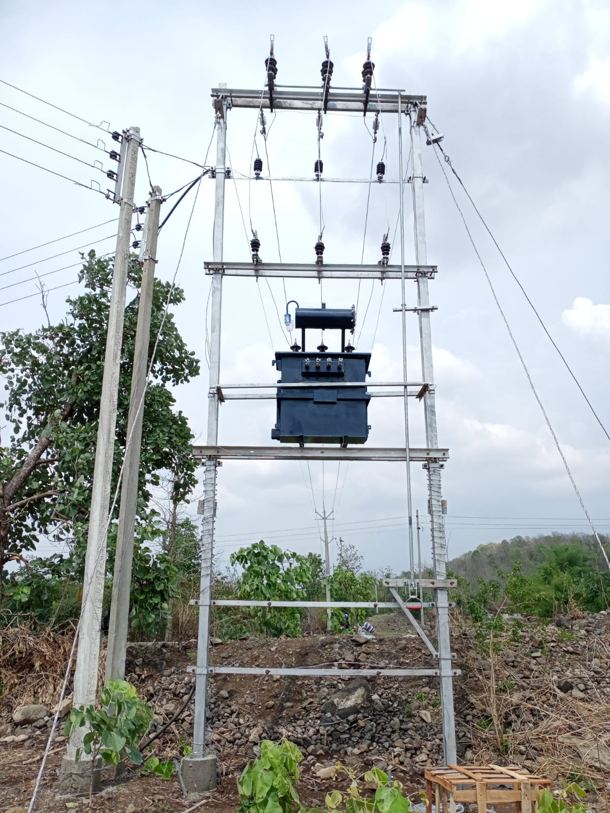
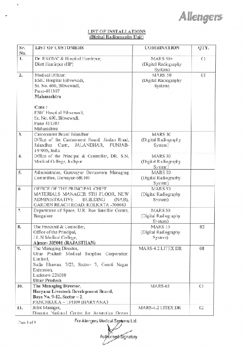
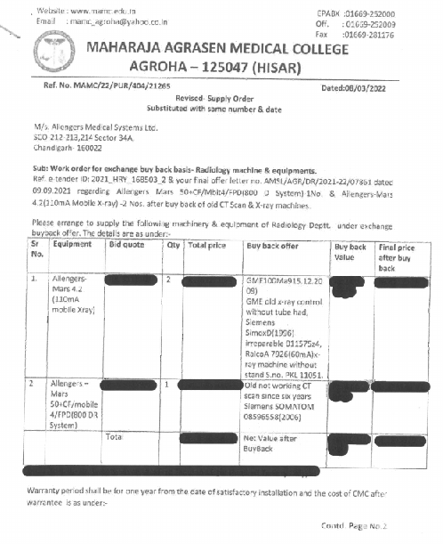
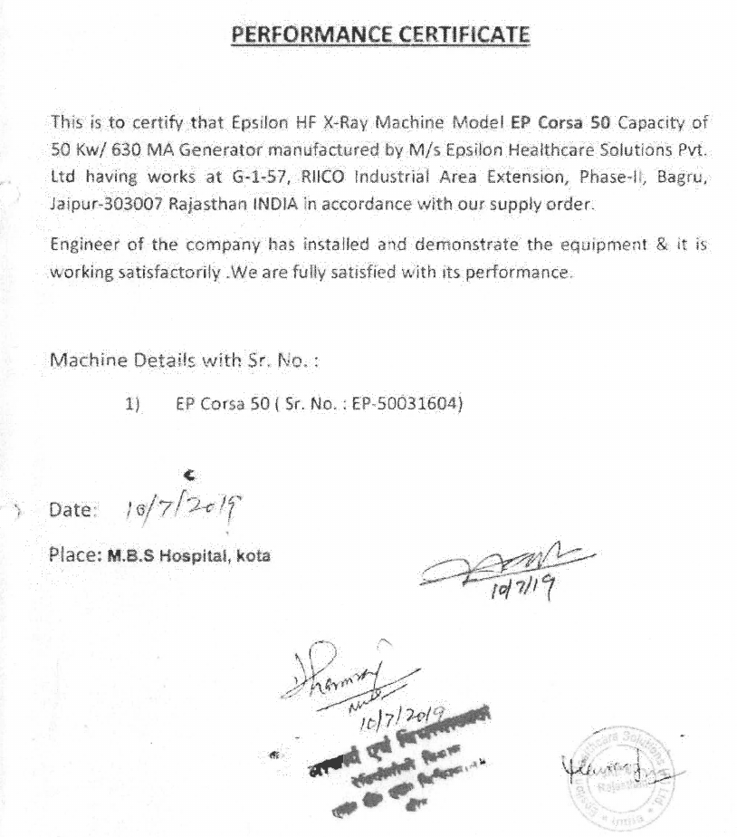
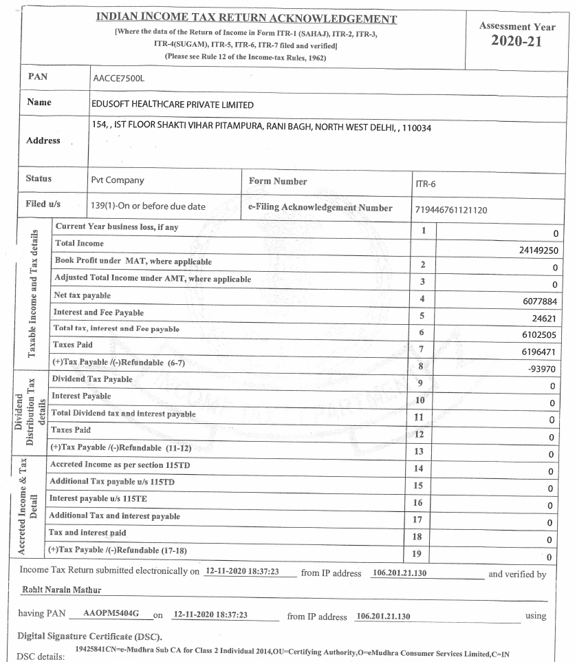
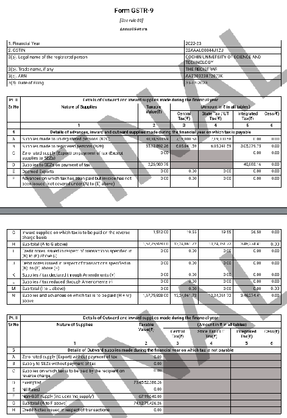
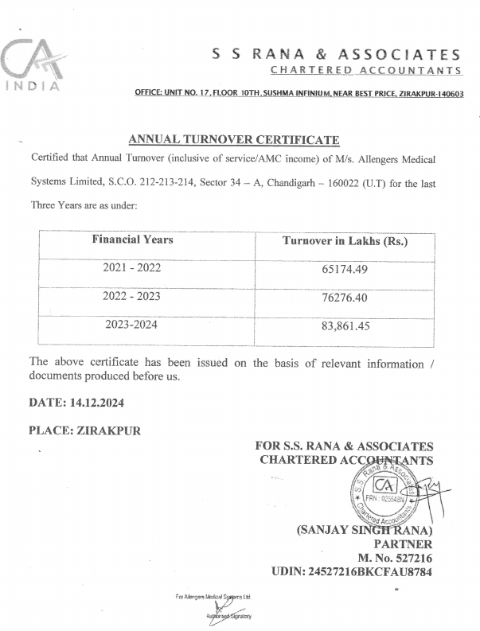
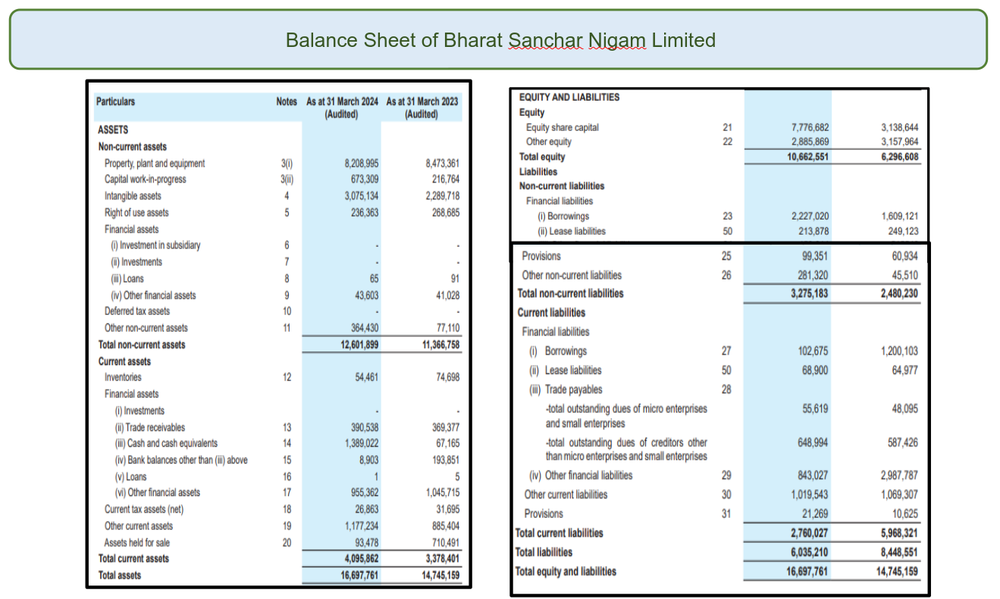
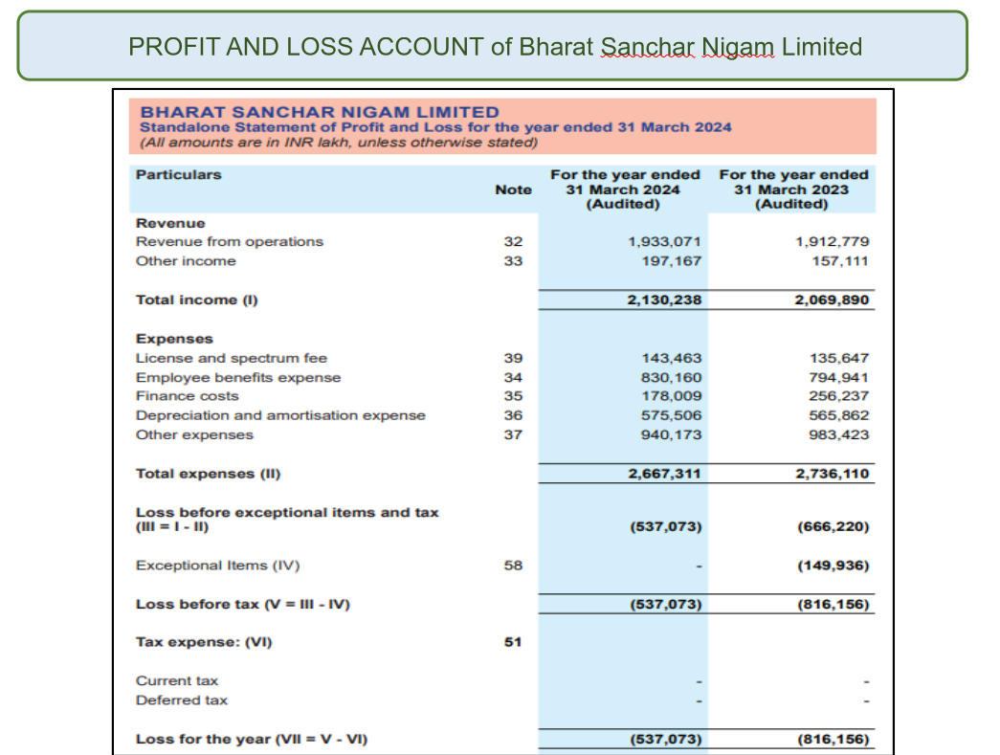

<!-- _class: lead -->

# Let us buy transformers

---

<!-- _class:  lead invert -->

# <!--fit--> When to buy?

---

<!-- _class: panel_capsule -->

# Identification of need

* :one:
  
  - One time requirement
* :repeat:
  
  - Recurrent requirement
* :warning:
  
  - Criticality
  

  
---

<!-- _class: icon_box -->

# Maintaining Stores

* :notebook:
  
  - All items received should be entered into stock register
* :pencil:
  
  - All items issued should be entered into stock register
* :mag_right:
  
  - Periodic verification of stock in hand
* :snail:
  
  - Identification of idle/slow moving stock
* :truck:
  
  - FIFO

---

<!-- _class: icon_card -->

# Determining Inventory Levels

* :bar_chart:
  
  - Historical consumption trend of items

* :hourglass_flowing_sand:
  
  - Rate of Depreciation / Warranty expiration

* :package:
  
  - Storage Capacity

* :hourglass:
  
  - Lead Time required for restocking

* :minidisc:
  
  - Minimum inventory level = Consumption expected during the lead time

* :warning:
  
  - Criticality of running out of stock

* :shopping_cart:
  
  - Trigger for procurement = when stock level falls to minimum inventory level

  
---

<!-- _class: icon_box -->

### When to initiate procurement for transformers

* :chart_with_downwards_trend:
  
  - Monthly consumption - 100

* :package:
  
  - Current Stock - 1000

* :minidisc:
  
  - Minimum Stock Level - 2 months requirement = 200

* :hourglass_flowing_sand:
  
  - Lead time for procurement - 3 months

* :shopping_cart:
  
  - Procurement trigger point = Min Stock Level + Consumption during Lead Time = 200 + 3*100 = 500

---

<!-- _class:  lead invert -->

# <!--fit--> How much to buy?

---

<!-- _class: panel -->

# How many transformers to buy?

* :calendar:
  
  - Monthly requirement - 100, so annual requirement = 1200

* :money_with_wings:
  
  - Check budget availability

* :package:
  
  - Check storage capacity

* :bar_chart:
  
  - Check any unusual demand forecast

  
---

<!-- _class:  lead invert -->

# <!--fit--> Which type to buy?

---

<!-- _class: icon_box -->

### What kind of transformer should we buy

* :gear:
  
  - Assess technical/performance requirements

* :department_store:
  
  - Examine options available in the **market**

* :balance_scale:
  
  - Do cost benefit analysis of options

* :white_check_mark:
  
  - **Finalize minimum requirements:**  TechnicalSpecification   Quality Requirements

* :moneybag:
  
  - Estimate cost of procurement

---

<!-- _class:  lead invert -->

# <!--fit--> How to buy?

---

# GeM Procurement

| Monetary Ceiling            | GeM Procedure                                                |
|-----------------------------|-------------------------------------------------------------|
| Up to ₹50,000               | Direct Purchase from available GeM supplier                 |
| ₹50,001 to ₹10,00,000       | Direct Purchase from L1 (lowest price) supplier; at least 3 different sellers (if possible) |
| Above ₹10,00,000            | Mandatory e-bidding or reverse auction                      |

---

# Non-GeM Procurement

| Monetary Ceiling                | Non-GeM Procedure                                            |
|---------------------------------|-------------------------------------------------------------|
| Up to ₹50,000                   | Direct Purchase (certificate of reasonableness required)    |
| ₹50,001 to ₹5,00,000            | Purchase via Local Purchase Committee recommendation         |
| ₹5,00,001 to ₹50,00,000         | Limited Tender Enquiry (bids from ≥3 suppliers)             |
| Above ₹50,00,000                | Advertised (Open) Tender Enquiry |

----

<!-- _class: panel_pillar -->

# How to procure?

* :handshake:
  
  - Direct Purchase

* :page_facing_up:
  
  - Local Purchase Committee based on Quotations

* :computer:
  
  - Better to use GeM portal for these

---

<!-- _class: lead -->

# Can we use Limited Tender?

----

<!-- _class: flower -->

### Limited Tender

* :card_index_dividers:
  
  - Requires Vendor Management System

* :alarm_clock:
  
  - Time saving

* :scroll:
  
  - Tender Notice still required to be published

* :money_with_wings:
  
  - Upto specific monetary limit only

----

<!-- _class:  lead -->

# Preparing Open Tender for procurement of transformers

----

<!-- _class: icon_box -->

# Option 1: GeM portal

* :bookmark_tabs:
  
  - Item category/catalogue should be available

* :incoming_envelope:
  
  - Else, send request for creation

* :sparkles:
  
  - **Benefits:** Standardized Processes and tender clauses Transparency  Seamless payments

---
<!-- _class: lead -->

# Option 2: Open Tender on e-procurement portal

---

<!-- _class: lead -->

# How to prepare bid documents?

----

<!-- _class: white -->

## Use Standard Bidding Documents

- Section I — NIT & **TIS**  
- Section II — ITB & Section III — **AITB**  
- Section IV — GCC & Section V — **SCC**  
- Section VI — **Schedule of Requirements**  
- Section VII — **Technical Specifications & QA**  
- Section VIII — **Qualification Criteria**  
- Forms & BOQ

----

<!-- _class:  lead -->

# What is the purpose of   Qualification Requirements (QR)?

----

<!-- _class: white -->

# Qualification Requirements (QR)

## Need to check the following

1) **Technical Capability** Usually work experience (say 80% of the tender quantity supplied in past three years)
2) **Financial Capability** Usually Turnover (say 60% of the cost estimate in previous FY). What else?

----
<!-- _class:  lead invert -->

# <!--fit--> Which documents will prove this?

---

<!-- _class:  lead invert -->

# <!--fit--> Documents for Technical Capability

---

<!-- _class: lead -->

# List?

---

<!-- _class: lead -->

# Work Order?

----

<!-- _class: lead -->

# Performance   Certificate?

---

<!-- _class: panel -->

# Work Experience

* GeM Order

  - Work Order + CRAC

* Non-GeM Order

  - Work Order + MRC

---

<!-- _class:  lead invert -->

# <!--fit--> Documents for Financial Capability

---

<!-- _class: lead -->

# ITR?

<!-- _header: ""  -->

---

<!-- _class: lead -->

# GSTR?

---

<!-- _class: lead -->

# CA   Certificate?

----

<!-- _header: ""  -->

---
<!-- _header: ""  -->

---

<!-- _class: panel_pillar -->

# Caution

* :thinking:
  
  - QR is subjective

* :balance_scale:
  
  - Trade-off between Comfort and Competition

* :mag_right:
  
  - Apply your mind, consult market, **Record**

---

<!-- _class: panel_capsule -->

# L1 Evaluation Criteria

* :bookmark_tabs:
  
  - Item wise

* :calendar:
  
  - Schedule wise

* :package:
  
  - Lumpsum

---

<!-- _class: panel_transparent -->

### Other Terms & Conditions (if specifically required)

* :bank:
  
  - Requirement of performance bank guarantee

* :alarm_clock:
  
  - Penalty for delay in supply

* :busts_in_silhouette:
  
  - Splitting of order among multiple vendors

* :credit_card:
  
  - Payment Milestones

* :left_right_arrow:
  
  - Quantity Variation clause

* :money_with_wings:
  
  - Price Variation clause

----

<!-- _class: icon_flower  -->

## Price Variation

* :calendar:
  - For long-term contracts > 12 months 

* :money_with_wings:
  - Particularly for high-value procurements

* :chart_with_downwards_trend:
  - For items prone to short-term price volatility

* :abacus:
  - Suitable price variation formula must be provided in the tender documents

* :memo:
  - Specify the base date, time lag period, variation periodicity, minimum threshold, and ceiling

* :no_entry:
  - Not applicable in case of default/deficiency

---

<!-- _class: panel -->

# Publication of Notice Inviting Tender

* :hourglass_flowing_sand:
    
  - **Usual submission deadline** 10 days prescribed in GeM 21 days otherwise

* :alarm_clock:
  
  - Adequate time extension in case of corrigendum

---

<!-- _class: lead -->

# Should we have a pre-bid conference?

---

<!-- _class: lead -->

## Use pre bid conference as an opportunity to rectify mistakes

---

<!-- _class: icon_pillar -->

# Bid Evaluation

* :page_facing_up:
  
  - EMD/EMD exemption document

* :microscope:
  
  - Technical Evaluation

* :money_with_wings:
  
  - Financial Evaluation

---

<!-- _class: panel_card-->

### Technical Evaluation

* :busts_in_silhouette:
  
  - Technical Evaluation Committee

* :bar_chart:
  
  - Comparative Evaluation Matrix

* :scroll:
  
  - Responsive vs Non-responsive bid

* :warning:
  
  - Caution while seeking clarifications

* :email:
  
  - Disposing complaints

* :no_entry:
  
  - Disqualification of bidders 

---

<!-- _class: lead invert  -->

# <!--fit--> Should we ask for sample / demonstration

---

<!-- _class: panel_shirt -->

# Financial Evaluation

* :page_facing_up:
  
  - Format of price bid to be prescribed

* :moneybag:
  
  - Must indicate total landed cost (inclusive of taxes, transportation, insurance, spares, warranty etc)

---

<!-- _class:  lead -->

# <!--fit--> Rate Reasonability

---

<!-- _class: lead invert  -->

# <!--fit--> Should we negotiate with L1 vendor

---

<!-- _class: panel_pillar -->

## Issue offer letter to L1 bidder (in some cases)

* :bookmark_tabs:
  
  - Indicate quantity, price, terms & conditions etc

* :bank:
  
  - In some cases performance guarantee and contract agreement may also be required

---

<!-- _class: lead -->

# Issue supply order

---

<!-- _class: panel_shirt -->

# Approval of drawings and Manufacturing Quality Plan (MQP)

* :gear:
  
  - Required for critical technical goods

* :white_check_mark:
  
  - To ensure compliance to technical specification and quality requirements

---

<!-- _class: panel-->

# Approval of sub-vendors/suppliers

* :white_check_mark:
  
  - To ensure quality of input components/raw materials

* :card_index_dividers:
  
  - Requires vendor assessment/approval

---

<!-- _class: panel_shirt -->

# Pre-despatch instruction (PDI)?

* :mag_right:
  
  - To ascertain quality of inputs and compliance to manufacturing quality plan

---

<!-- _class: panel_shirt -->

# Despatch instruction (DI)

* :package:
  
  - Instruct supplier to deliver goods to consignee(s)

---

<!-- _class: icon_pillar -->

# Delivery of Goods

* :eyes:
  
  - Physical inspection

* :test_tube:
  
  - Sampling for quality tests

* :microscope:
  
  - Quality testing

* :page_facing_up:
  
  - Issuance of Material Receipt Certificate (MRC)

* :no_entry:
  
  - Rejection in case of test failure

----

<!-- _class: panel -->

# Invoicing & Payment

* :page_facing_up:
  
  - Supplier issues invoice based on MRC

* :money_with_wings:
  
  - Check for any pending penalty, recovery against mobilisation advance, price variation adjustments etc

* :credit_card:
  
  - Issue payments

---

<!-- _class: icon_box -->

### Disputes

* :no_entry:
  
  - Refusing to accept supply order -> Forfeiture of EMD

* :alarm_clock:
  
  - Delay in supply -> penalty, if prescribed

* :package:
  
  - Part supply -> depends on how payment terms are defined
    - Goods should be eligible for payment only when they are supplied in usable condition
    - Payments can be made for the eligible portion of the supply

* :warning:
  
  - Seasonal withholding and dumping

---

<!-- _class: icon_box -->

### Disputes

* :cloud_with_lightning:
  
  - Force-Majeure

* :hourglass:
  
  - Time extension

* :chart_with_upwards_trend:
  
  - Price Escalation

* :handshake:
  
  - Violation of Integrity Pact

* :scroll:
  
  - Breach of contract -> Events need to be defined beforehand
    - Contract Termination
    - Blacklisting -> to be used very rarely

* :balance_scale:
  
  - Arbitration / Mediation

* :hammer:
  
  - Litigation

---

<!-- _class: lead gaia -->

# <!--fit-->Questions

   

  

  
