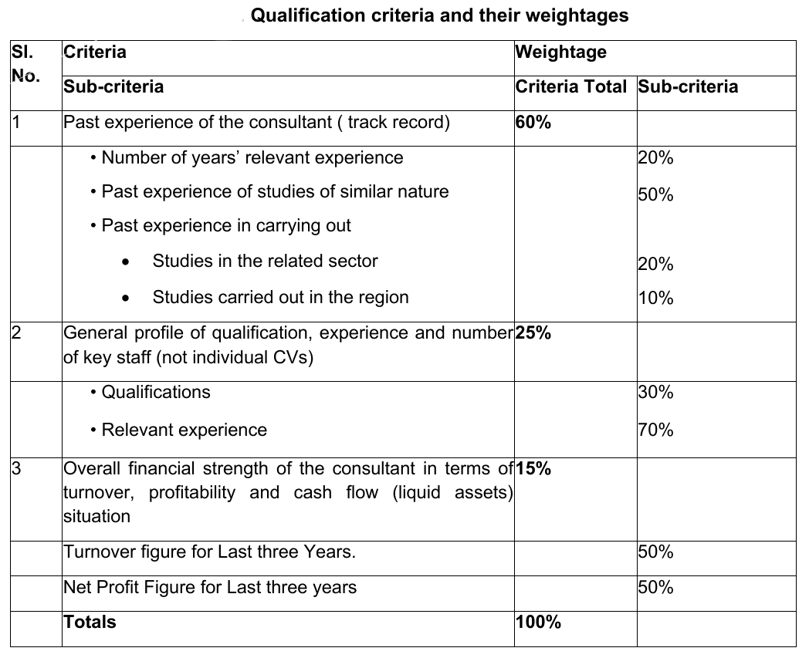
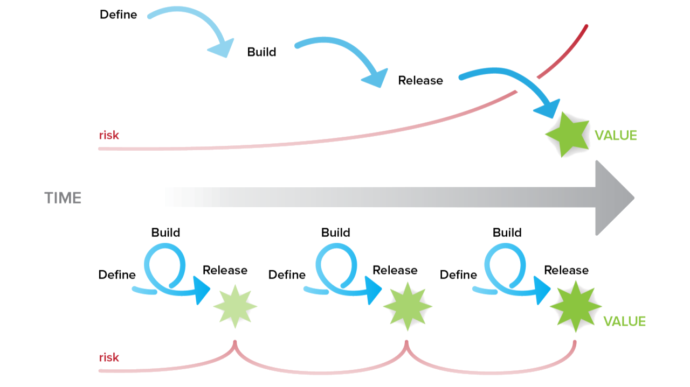

<!-- _class: invert lead -->

# Consultancy 
# and 
# Non-consultancy services

----

<!-- _class: icon_flower -->

## Consultancy Services (Rule 177 of GFR 2017)

* :brain:
  
  - Intellectual, strategic, and advisory services.

* :scroll:
  
  - Deliverables vary from one consultant to another.

* :briefcase:
  
  - Examples: Management, policy, communications, feasibility studies, engineering, finance, IT projects.

* :computer:
  
  - IT procurement typically classified as consultancy.

---

<!-- _class: icon_flower -->

### Non-Consultancy Services (Defined by Exclusion)

* :repeat:
  
  - Routine, repetitive, procedural tasks with tangible performance standards.

* :truck:
  
  - Includes transport, courier, maintenance, housekeeping, etc.

* :bar_chart:
  
  - Contracts based on measurable outcomes.

* :hammer:
  
  - Small works and incidental consultancy services may be included in this category.

---

<!-- _class: invert lead -->

# Procurement of Consultancy Services

----

<!-- _class: lead -->

# Clarity about Scope of Work? 
### Can we float tender without this clarity?

---

<!-- _class: lead  -->

# How to get this clarity?

---

<!-- _class: lead -->

# Stage - I: Expression of Interest (EoI)

---

<!-- _class: icon_pillar4 -->

## Contents of an Expression of Interest (EoI)

* :mailbox:
  
  - **Letter of Invitation**

* :page_with_curl:
  
  - **Instructions to Consultants**

* :books:
  
  - **Description of Services**

* :medal_sports:
  
  - **Qualification Criteria**

  
--- 

<!-- _class: lead -->
  
# How to shortlist?

---

<!-- _class: panel_transparent -->

# Scoring-Based Shortlisting

* :bar_chart:
  
  - Consultants are assigned scores based on **predefined criteria**.

* :busts_in_silhouette:
  
  - Criteria include **experience, manpower strength, and financial stability**.

* :memo:
  
  - Table of weightages provided for systematic evaluation.

---

<!-- _class:  lead -->

---

<!-- _class: flower -->

### Minimum Qualification Threshold

* :medal_sports:
  
  - **Standard requirement:** Firms scoring the threshold (say 75% or higher) qualify.

* :page_facing_up:
  
  - Criteria must be clearly defined in the **EoI document**.

* :white_check_mark:
  
  - Simpler **pass-fail benchmarks** can also be used.

* :shield:
  
  - Ensures that only competent firms proceed to the next stage.

---

<!-- _class: panel_shirt-->

# Composition of the Short List

* :three:
  
  - Typically, **3 to 8 firms** are shortlisted.

* :mailbox:
  
  - Shortlisted firms receive the **RfP (Request for Proposal)**.

---

<!-- _class: lead -->

# Get Clarity, Ideas, Vision - Frame ToR

---

<!-- _class: panel -->

# Terms of Reference (ToR)

* :memo:
  
  - Definition of scope and objectives

* :calendar:
  
  - Deliverables and timelines

* :white_check_mark:
  
  - Performance evaluation criteria

---

<!-- _class: lead -->

# Stage - II: Request for Proposal (RFP)

---

<!-- _class: panel -->

# Request for Proposal (RFP)

* :scroll:
  
  - Request for Proposals (RfP) is the bidding document in which the technical and financial proposals from the consultants are obtained.

* :mailbox:
  
  - For procurement of Consultancy Services, the RfP is sent only to the short listed consultants.

---

<!-- _class: icon_capsule -->

## RfP contents 

* :mailbox:
  
  - A letter of invitation (LoI)

* :memo:
  
  - Terms of Reference (ToR)

* :medal_sports:
  
  - Qualifications and experience of the firm and key experts

* :balance_scale:
  
  - Criteria of proposal evaluation and selection procedure

* :no_entry_sign:
  
  - Bid security - usually not asked in consultancy

---

<!-- _class: icon_box lead-->

# Systems of Selection of Service Providers

---

<!-- _class: panel -->

# Least Cost Selection (LCS)

* :moneybag:
  
  - Selection of lowest cost technically qualified bidder

* :bookmark_tabs:
  
  - Suitable for standard services with clear specifications

* :chart_with_downwards_trend:
  
  - Ensures cost efficiency but may compromise quality

---

<!-- _class: panel_capsule -->

## Quality and Cost-Based Selection (QCBS)

* :balance_scale:
  
  - Balances quality and cost in selection process

* :bar_chart:
  
  - Weighted evaluation criteria (e.g., 80% quality, 20% cost)

* :briefcase:
  
  - Suitable for complex consultancy assignments

----

### ⚖️ QCBS Scoring Formula

$
B = \frac{C_{low}}{C} X + \frac{T}{T_{high}} (1 - X)
$

Where:  
| Symbol | Meaning |
|--------|---------|
| **$C$** | Evaluated Bid Price |
| **$C_{low}$** | Lowest evaluated price among responsive bids |
| **$T$** | Total technical score of the bid |
| **$T_{high}$** | Highest technical score among all bids |
| **$X$** | Weightage for price (e.g., 0.2 = 20%) |

The bid with the **highest final evaluated score (B)** becomes the **Most Advantageous Bid**.

---

# 🧠 Interpretation of the Formula

📌 **Price term** → $\frac{C_{low}}{C} X$ 
Higher score for lower price.

📌 **Technical term** → $\frac{T}{T_{high}} (1 - X)$ 
Higher score for better technical performance.

📌 **Weights**  
- If **X is high**, cost has more influence.  
- If **X is low**, technical quality drives the decision.

---

# 🧮 Example Calculation

Assume:
- $C = ₹200,000$, $C_{low}$ = ₹150,000
- $T = 85$, $T_{high} = 92$
- $X = 0.3$ (30% cost, 70% technical)

$
B = \frac{150,000}{200,000}(0.3) + \frac{85}{92}(0.7)
= 0.225 + 0.646
= \mathbf{0.871}
$

➡ Higher **B** = better value.

---

<!-- _class: flower  -->

### Points to consider

* :balance_scale:
  - Distribution of weights between technical & financial criteria

* :abacus:
  - Scores for components of technical scoring

* :tv:
  - Should we have presentations?

* :arrows_counterclockwise:
  - Resource Substitution Clause

---

<!-- _class: invert lead -->

# Procurement of Non-Consultancy Services

---

<!-- _class:  lead -->

# Period of Contract
Usually for two years + one year extension clause

---

<!-- _class: panel-->

# Types of Contracts in Non-consultancy Services

* :moneybag:
  
  - Lump-sum contracts (eg Whitewash of office building)

* :clock1:
  
  - Time-based contracts (eg. Hiring housekeeping staff)

* :straight_ruler:
  
  - Unit (item/ service) rate based contract (eg. Taxi Services) 

---

<!-- _class: icon_card -->

## Preparation of Activity Schedule

* :memo:
  
  - Description of Services

* :busts_in_silhouette:
  
  - Labour/ Personnel Activity Schedule

* :package:
  
  - Material Schedule

* :hammer:
  
  - Essential Equipment Schedule

* :scroll:
  
  - Statutory and contractual obligations to be complied with by the contractor

* :factory:
  
  - Facilities and Utilities to be provided by the Procuring Entity to service provider at Site

---

<!-- _class: panel -->

# Qualification Requirements

## Financial Capability

* :moneybag:
  
  - Average Annual financial turnover of **related services** during the last three years 

* :credit_card:
  
  - Adequate liquidity and/or credit facilities (especially for manpower outsourcing)

---

<!-- _class: icon_box -->

## Past Experience

* :briefcase:
  
  - At least three years’ experience of providing similar type of services

* :medal_sports:
  
  - **Successful work completion in last 3 years:**
  
  * :arrow_right: Three works - 40% of the estimated cost; or :arrow_right: Two works - 50% of the estimated cost; or :arrow_right: One work - 80% of the estimated cost.

---

<!-- _class: panel -->

# L1 selection criteria

* :chart_with_upwards_trend:
  
  - One figure which captures the total life cycle cost

* :balance_scale:
  
  - Use weightages (based on historical data) for unit rate based contracts

----

<!-- _class: icon_box -->

## :tent: Illustration - Investor Summit Logistics

- :earth_asia:
  - 2-day summit with 1000–2000 attendees

- :chair:
  - Tent, stage, decor, seating to be hired

* :bar_chart:  
  - Indicative consumption figures based on past experience

* :balance_scale:  
  - Weighted L1 Formula to be provided in the tender documents

* 
  - $Total\_Value= 2000*per\_chair\_rate + 500*per\_table\_rate + 10000*per\_sqft\_rate\_of\_tent$

* :trophy:  
  - L1 is the one with lowest &nbsp; $Total\_Value$

---

<!-- _class:  lead -->

# Outsourcing Options

---

<!-- _class: panel  -->

### Option 1: Take manpower from outsourcing service provider

* :wrench:
  - In-house O&M + Consumables

* :busts_in_silhouette:
  - Full control and flexibility; mix of outsourced and own staff

* :warning:
  - Performance accountability problem for outsourced staff

---

<!-- _class: panel  -->

### Option 2: Outsource O&M based on SLA

* :dart:
  - Outcome oriented

* :memo:
  - SLA based

---

<!-- _class:  lead -->
# Service Level Agreement (SLA)

----

<!-- _class: icon_flower-->

# Service elements

* :gear:
  
  - Services to be provided

* :white_check_mark:
  
  - Conditions of service availability

* :alarm_clock:
  
  - Service standards, such as the timeframes within which services will be provided / remedied

* :busts_in_silhouette:
  
  - Responsibilities of both parties

* :warning:
  
  - Escalation procedures in case of performance deficiencies

---

<!-- _class: icon_flower-->

# Management elements

* :bar_chart:
  
  - How service effectiveness will be tracked

* :page_facing_up:
  
  - How information about service effectiveness will be reported and addressed

* :handshake:
  
  - How service-related disagreements will be resolved 

* :repeat:
  
  - How the parties will review and revise the SLA - Conditions warranting change; Change frequency and Change procedures

----

<!-- _class: lead -->
  
# Development of software from scratch

---

# Two approaches

<!-- _class: panel_shirt -->

* :man_artist:
  - Vendor led development

* :office:
  - Institutional development
  
----

### Waterfall and agile projects

----

<!-- _class: icon_box -->

# Points to consider

* :rocket:
  - Software development, especially for fresh ideas, is an agile project

* :construction:
  - Vendor-based development in such cases might be difficult

* :link:
  - Buying software from a vendor is not a one-time exercise; you get tied with the vendor for a very long time

* :warning:
  - Disputes regarding IP rights, data, maintenance, code handover etc.

---

<!-- _class: icon_box -->

# Suggested Strategy

* :bust_in_silhouette:
  - Hire programmers for fresh software development

* :wrench:
  - You will need support engineers for project life cycle

* :repeat:
  - Once business processes are mature/refined, subsequent deployment may be tendered out to vendors

* :floppy_disk:
  - Use open-source technologies; be mindful of licensing costs

* :globe_with_meridians:
  - Mandate using openforge.gov.in for deployment of production code

* :cloud:
  - Cloud services – State Data Center / NIC Meghraj / Procure on GeM

---

<!-- _class:  lead gaia-->

# <!--fit-->Questions  :question:

